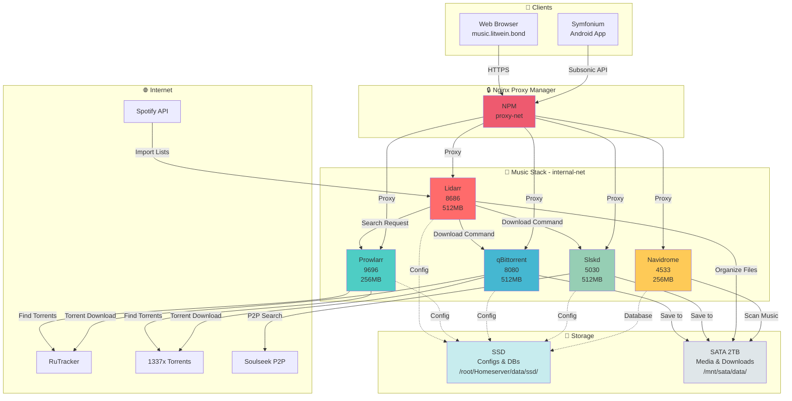
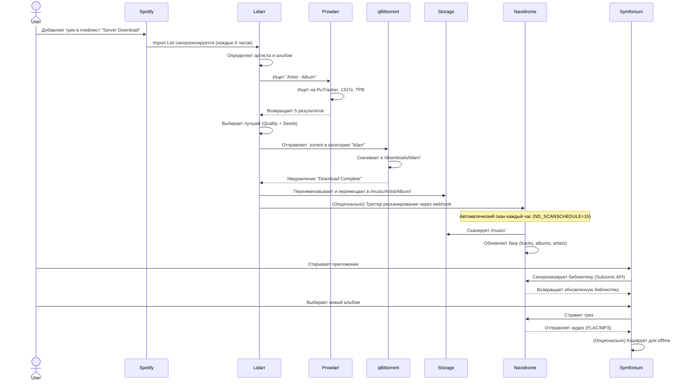
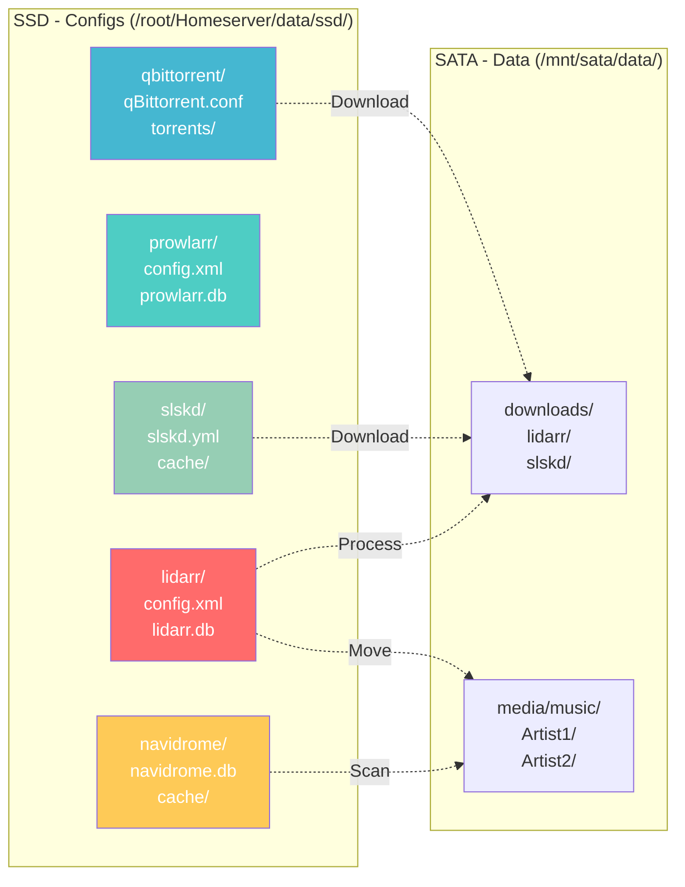
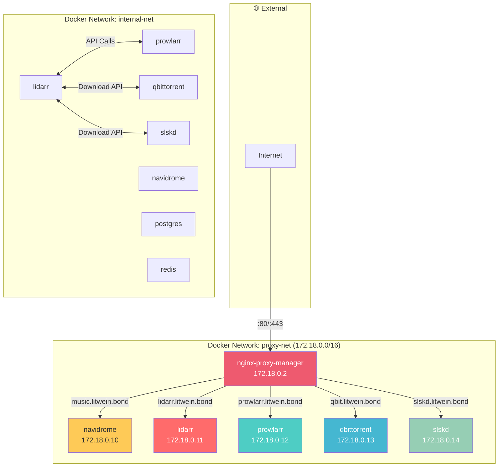
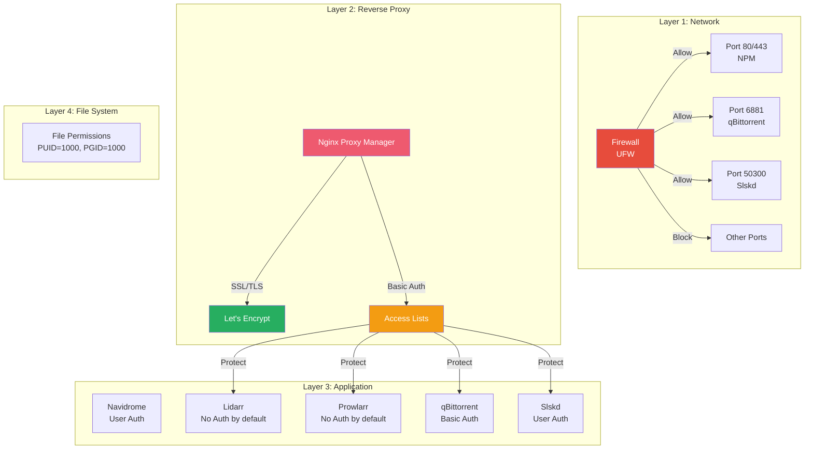
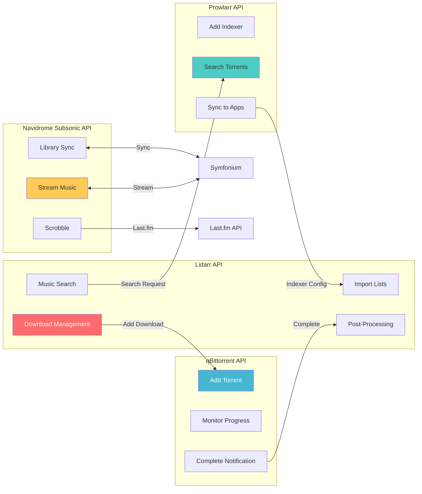
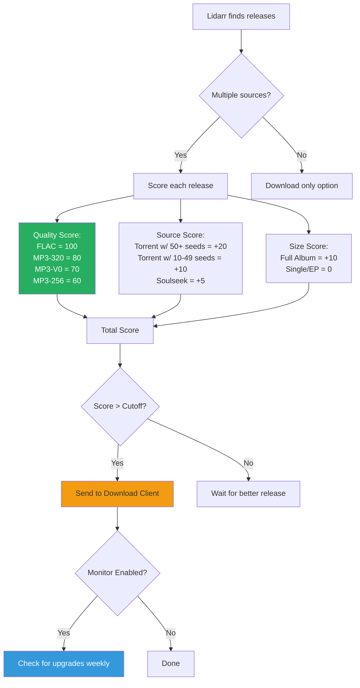
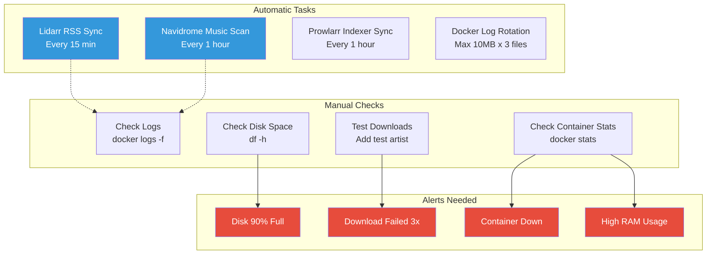
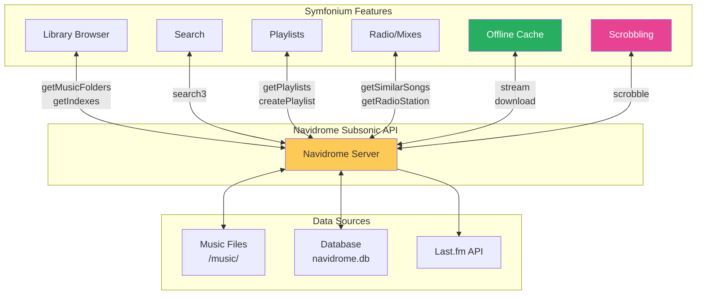
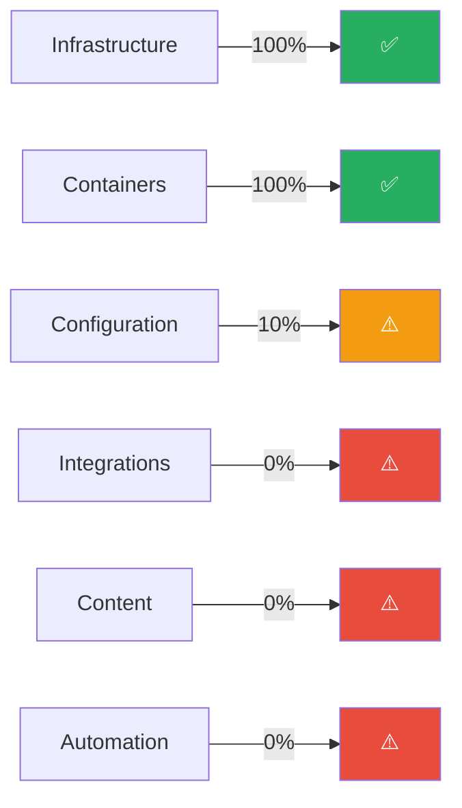

# 🎵 Архитектура музыкального стека

## 📐 Общая схема компонентов



---

## 🔄 Workflow: От поиска до прослушивания



---

## 🗂️ Структура данных



---

## 🔌 Сетевая архитектура



---

## 🔐 Security Layers



---

## 📊 Data Flow: Music Organization

```mermaid
graph TD
    A[Torrent Downloaded<br/>/downloads/lidarr/Artist - Album - 2020 - FLAC/] -->|Lidarr Processing| B{Check Quality}
    B -->|FLAC ✓| C[Extract Metadata]
    B -->|MP3 320 ✓| C
    B -->|Low Quality ✗| X[Reject & Delete]
    
    C --> D[Rename Files]
    D --> E[Apply Tags:<br/>Artist, Album, Year, Genre]
    E --> F[Create Directory Structure]
    
    F --> G[/music/<br/>Artist Name/<br/>Album Title Year/<br/>01 - Track Name.flac]
    
    G --> H[Set Permissions<br/>chmod 755]
    H --> I[Trigger Navidrome Scan]
    I --> J[Navidrome Updates DB]
    J --> K[Available for Streaming]
    
    X --> Z[Report Failed Download]

    style A fill:#45b7d1
    style G fill:#27ae60,color:#fff
    style K fill:#feca57
    style X fill:#e74c3c,color:#fff
```

---

## 🧩 Integration Points



---

## 🎯 Quality Selection Logic



---

## 🔄 Monitoring & Maintenance



---

## 📱 Client Interaction



---

## 🎓 Legend

| Color | Meaning |
|-------|---------|
| 🔴 Red | Lidarr (Music Management) |
| 🔵 Blue | qBittorrent (Torrent Client) |
| 🟢 Green | Slskd (Soulseek P2P) |
| 🟡 Yellow | Navidrome (Streaming Server) |
| 🟣 Purple | Prowlarr (Indexer Manager) |
| 🔶 Orange | NPM (Reverse Proxy) |
| ⚪ Gray | Storage (SSD/SATA) |

---

## 📐 Hardware Requirements (Current Setup)

```
Server: root@167.253.157.7

CPU:     4 cores (sufficient)
RAM:     6 GB total
         - Used: 2.9 GB
         - Available: 2.8 GB
         - Swap: 18 GB (3.3 GB used)

Storage:
  - SSD (system):     ~100 GB (configs & databases)
  - SATA (data):      2 TB (47 GB used, 1.9 TB free)

Network:
  - Bandwidth: Unlimited (assuming VPS/Dedicated)
  - Ports: 80, 443, 6881, 50300 open
```

---

## 🚦 Current Status



**Overall: 18% Ready → 20 minutes of configuration needed**

---

## 🔗 References

- Docker Compose: `/root/Homeserver/docker-compose.yml`
- Environment: `/root/Homeserver/.env`
- Documentation:
  - `MUSIC_STACK_AUDIT.md` (Full audit)
  - `MUSIC_QUICK_SETUP.md` (Setup guide)
  - `MUSIC_SLSKD_ADDON.md` (Soulseek extension)
  - `MUSIC_STACK_SUMMARY.md` (Executive summary)

---

**Created:** November 29, 2025  
**Version:** 1.0  
**Purpose:** Visual reference for music stack architecture

