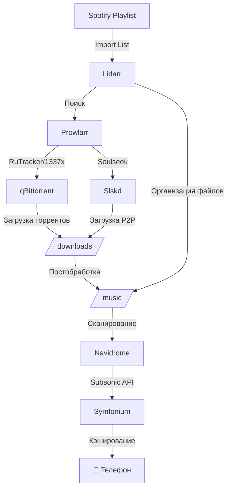

# 🎵 Аудит музыкального стека Navidrome

**Дата проверки:** 29 ноября 2025  
**Сервер:** 167.253.157.7  
**Домен:** litwein.bond

---

## 📊 Текущее состояние

### ✅ Что работает

| Сервис | Статус | Порт | Контейнер |
|--------|--------|------|-----------|
| **Navidrome** | 🟢 Работает | 4533 | Up 2 days |
| **Lidarr** | 🟢 Работает | 8686 | Up 2 days |
| **Prowlarr** | 🟢 Работает | 9696 | Up 2 days |
| **qBittorrent** | 🟢 Работает | 8080, 6881 | Up 2 days |

### 📁 Структура хранилища

```
Корень проекта: /root/Homeserver/

SSD (конфигурации):
├── /root/Homeserver/data/ssd/
│   ├── navidrome/          # База Navidrome
│   ├── lidarr/             # Конфиг Lidarr
│   ├── prowlarr/           # Конфиг Prowlarr
│   └── qbittorrent/        # Конфиг qBittorrent

SATA (данные):
├── /mnt/sata/data/         # 2TB (используется 3%)
│   ├── downloads/          # ⚠️ ПУСТАЯ
│   └── media/
│       ├── music/          # ⚠️ ПУСТАЯ (0 треков в Navidrome)
│       ├── movies/
│       └── tv/
```

---

## 🚨 КРИТИЧЕСКИЕ ПРОБЛЕМЫ

### 1. ⚠️ Музыкальная библиотека пустая

**Проблема:**
- `/mnt/sata/data/media/music/` — директория создана, но **пустая**
- Navidrome показывает: `"tracks":0, "albums":0, "artists":0`
- Сканирование завершается за 22мс (нечего сканировать)

**Решение:**
```bash
# Вручную добавить тестовую музыку для проверки
# Или запустить первую загрузку через Lidarr
```

---

### 2. ⚠️ Lidarr не может искать музыку

**Проблема в логах:**
```
[Warn] FetchAndParseRssService: No available indexers. check your configuration.
[Info] DownloadDecisionMaker: No results found
```

**Причина:** Lidarr не подключен к индексаторам (трекерам).

**Требуется:**
1. ✅ Настроить **Prowlarr** (добавить трекеры: RuTracker, NNMClub, 1337x)
2. ✅ Подключить Prowlarr к Lidarr (через API)
3. ✅ Добавить клиент загрузки (qBittorrent уже есть)
4. ✅ Проверить Root Folder в Lidarr → `/music`

---

### 3. ⚠️ Spotify интеграция отключена

**Navidrome лог:**
```
level=info msg="Spotify integration is not enabled: missing ID/Secret"
```

**Что это даёт:**
- Автоматическое добавление артистов из Spotify плейлистов в Lidarr
- Отслеживание новых альбомов любимых исполнителей
- Умные плейлисты на основе Spotify Discover Weekly

**Требуется:**
1. Создать Spotify App: https://developer.spotify.com/dashboard
2. Добавить переменные в `.env`:
```env
# Navidrome Spotify Integration
NAVIDROME_SPOTIFY_ID=your_client_id
NAVIDROME_SPOTIFY_SECRET=your_client_secret
```
3. Добавить в `docker-compose.yml`:
```yaml
navidrome:
  environment:
    - ND_SPOTIFY_ID=${NAVIDROME_SPOTIFY_ID}
    - ND_SPOTIFY_SECRET=${NAVIDROME_SPOTIFY_SECRET}
```

---

### 4. ⚠️ Отсутствует Slskd (Soulseek)

**Проблема:**
- Торренты не всегда содержат редкую музыку, FLAC, синглы
- Soulseek — специализированная P2P сеть для музыки
- Lidarr умеет интегрироваться с Slskd

**Рекомендация:** Добавить Slskd в стек

---

### 5. ⚠️ Lidarr не настроен на работу с qBittorrent

**Требуется:**
- В Lidarr → Settings → Download Clients → Add qBittorrent
- Host: `qbittorrent` (имя контейнера)
- Port: `8080`
- Username/Password из qBittorrent

---

### 6. ⚠️ Нет Import List из Spotify

**Что это:**
- Lidarr может автоматически мониторить твои плейлисты Spotify
- Ты добавляешь песню в плейлист → Lidarr качает альбом

**Требуется:**
1. В Lidarr → Settings → Import Lists → Add → Spotify Saved Albums/Playlists
2. Авторизоваться через Spotify
3. Выбрать плейлист для мониторинга (например, "Server Download")

---

## 📋 Чек-лист первичной настройки

### Prowlarr

- [ ] **Добавить индексаторы (трекеры):**
  - [ ] RuTracker (музыка на русском)
  - [ ] 1337x (международный)
  - [ ] The Pirate Bay (резервный)
  - [ ] NNMClub (опционально)

- [ ] **Синхронизировать с Lidarr:**
  - [ ] Settings → Apps → Add → Lidarr
  - [ ] Prowlarr Server: `http://prowlarr:9696`
  - [ ] Lidarr Server: `http://lidarr:8686`
  - [ ] API Key скопировать из Lidarr → Settings → General

### Lidarr

- [ ] **Download Client:**
  - [ ] Settings → Download Clients → Add → qBittorrent
  - [ ] Host: `qbittorrent`
  - [ ] Port: `8080`
  - [ ] Username: `admin`
  - [ ] Password: из qBittorrent WebUI

- [ ] **Root Folder:**
  - [ ] Settings → Media Management → Root Folders
  - [ ] Проверить, что путь: `/music`

- [ ] **Import Lists:**
  - [ ] Settings → Import Lists → Add → Spotify
  - [ ] Авторизоваться и выбрать плейлист

- [ ] **Quality Profiles:**
  - [ ] Settings → Profiles → Выбрать FLAC или Lossless (если есть место)

### qBittorrent

- [ ] **Настроить категории:**
  - [ ] Categories → Add → `lidarr`
  - [ ] Save Path: `/downloads/music`

- [ ] **Проверить порты:**
  - [ ] Tools → Options → Connection
  - [ ] Port: `6881` (уже открыт в `docker-compose.yml`)

### Navidrome

- [ ] **Добавить Spotify интеграцию** (см. проблему #3)
- [ ] **Проверить сканирование:**
  - [ ] После добавления музыки: Settings → Scan Library Now

---

## 🎯 Рекомендуемые улучшения

### 1. Добавить Slskd (Soulseek)

**В `docker-compose.yml`:**
```yaml
slskd:
  image: slskd/slskd:latest
  container_name: slskd
  restart: unless-stopped
  environment:
    - SLSKD_HTTP_PORT=5030
    - SLSKD_SLSK_LISTEN_PORT=50300
    - SLSKD_SHARED_DIR=/music
    - SLSKD_DOWNLOADS_DIR=/downloads/slskd
  volumes:
    - ${SSD_ROOT}/slskd:/app
    - ${SATA_ROOT}/media/music:/music
    - ${SATA_ROOT}/downloads:/downloads
  ports:
    - "50300:50300"
  networks:
    - internal-net
    - proxy-net
  mem_limit: 512m
  logging: *default-logging
```

**Интеграция с Lidarr:**
- Lidarr → Settings → Download Clients → Add → Slskd
- API Key из Slskd WebUI

---

### 2. Настроить автоматическую организацию файлов

**В Lidarr → Settings → Media Management:**
- [ ] Rename Tracks: `Enabled`
- [ ] Replace Illegal Characters: `Enabled`
- [ ] Standard Track Format:
```
{Artist Name}/{Album Title} ({Release Year})/{track:00} - {Track Title}
```

**Результат:**
```
/music/
  └── Radiohead/
      └── OK Computer (1997)/
          ├── 01 - Airbag.flac
          ├── 02 - Paranoid Android.flac
          └── ...
```

---

### 3. Включить Notifications в Lidarr

**Зачем:**
- Уведомления в Telegram/Discord/Email о загрузках
- Автоматический ресканирование Navidrome после добавления музыки

**Настройка:**
1. Lidarr → Settings → Connect → Add → Custom Script
2. Script Path: `/config/scripts/notify_navidrome.sh`
3. Скрипт:
```bash
#!/bin/bash
# Триггерит ресканирование Navidrome после загрузки
curl -X POST http://navidrome:4533/api/scan
```

---

### 4. Создать скрипт для быстрого добавления музыки

**Файл:** `scripts/add_music_to_lidarr.sh`
```bash
#!/bin/bash
# Использование: ./add_music_to_lidarr.sh "Artist Name"

LIDARR_URL="http://localhost:8686"
LIDARR_API_KEY="YOUR_API_KEY"  # Из Lidarr → Settings → General

curl -X POST "$LIDARR_URL/api/v1/search" \
  -H "X-Api-Key: $LIDARR_API_KEY" \
  -H "Content-Type: application/json" \
  -d "{\"term\": \"$1\"}"
```

---

### 5. Настроить Last.fm scrobbling

**Почему:**
- История прослушиваний
- Рекомендации на основе вкуса
- Совместимость с Symfonium

**В Navidrome WebUI:**
- Settings → Last.fm → Link Account

---

## 🔧 Команды для диагностики

```bash
# Проверить статус контейнеров
docker ps | grep -E '(navidrome|lidarr|prowlarr|qbit|slskd)'

# Посмотреть логи
docker logs lidarr --tail 50
docker logs prowlarr --tail 50
docker logs navidrome --tail 50

# Проверить права доступа к музыке
docker exec lidarr ls -lah /music
docker exec navidrome ls -lah /music

# Запустить ручное сканирование Navidrome
docker exec navidrome curl -X POST http://localhost:4533/api/scan

# Проверить размер библиотеки
du -sh /mnt/sata/data/media/music

# Проверить загрузки
ls -lah /mnt/sata/data/downloads/
```

---

## 📱 Symfonium: Настройка клиента

### Установка
- Google Play: https://play.google.com/store/apps/details?id=app.symfonium.music
- Цена: ~$5 (единоразово)

### Первый запуск
1. Add Server → Subsonic-compatible
2. Server URL: `https://music.litwein.bond`
3. Username/Password из Navidrome
4. Sync Library

### Фичи для включения
- **Offline Mode:** Settings → Cache → Enable Smart Offline
- **Radio/Mixes:** Library → Mixes (автогенерация на основе библиотеки)
- **Download Quality:** Settings → Downloads → FLAC (если место есть)

---

## 🎯 Итоговая схема работы



### Процесс:
1. **Поиск музыки:**
   - Слышишь трек → Shazam → Добавляешь в Spotify плейлист
   
2. **Автоматика:**
   - Lidarr видит новый трек через Import List
   - Ищет альбом через Prowlarr
   - Качает через qBittorrent/Slskd
   
3. **Постобработка:**
   - Lidarr переименовывает файлы
   - Перемещает в `/music/Artist/Album/`
   - Триггерит уведомление для Navidrome
   
4. **Стриминг:**
   - Navidrome сканирует новую музыку
   - Symfonium синхронизирует библиотеку
   - Ты слушаешь где угодно

---

## 🚀 Quick Start (Пошаговая инструкция)

### Шаг 1: Настройка Prowlarr
```bash
# 1. Открой: https://prowlarr.litwein.bond (или http://IP:9696)
# 2. Settings → General → Скопируй API Key
# 3. Indexers → Add Indexer:
#    - RuTracker
#    - 1337x
# 4. Apps → Add Application → Lidarr:
#    - Prowlarr Server: http://prowlarr:9696
#    - Lidarr Server: http://lidarr:8686
#    - API Key: (из Lidarr Settings → General)
```

### Шаг 2: Настройка Lidarr
```bash
# 1. Открой: https://lidarr.litwein.bond (или http://IP:8686)
# 2. Settings → Download Clients → Add → qBittorrent:
#    - Host: qbittorrent
#    - Port: 8080
#    - Username: admin
#    - Password: (из qBittorrent)
# 3. Settings → Media Management → Root Folders:
#    - Проверь: /music
# 4. Settings → Import Lists → Add → Spotify:
#    - Авторизуйся и выбери плейлист
```

### Шаг 3: Добавь первого артиста
```bash
# В Lidarr WebUI:
# 1. Library → Add New
# 2. Поиск: "Radiohead"
# 3. Root Folder: /music
# 4. Quality Profile: Any (или Lossless/FLAC)
# 5. Monitor: All Albums
# 6. Search on Add: Yes
# 7. Add Artist
```

### Шаг 4: Проверка
```bash
# Проверь, что музыка загружается:
docker logs lidarr -f

# После загрузки проверь Navidrome:
docker logs navidrome -f

# Или зайди в WebUI: https://music.litwein.bond
```

---

## 📞 Troubleshooting

| Проблема | Решение |
|----------|---------|
| Lidarr не находит музыку | Проверь индексаторы в Prowlarr |
| qBittorrent не качает | Проверь Download Client в Lidarr |
| Navidrome не видит файлы | Проверь права доступа: `chown -R 1000:1000 /mnt/sata/data/media/music` |
| Spotify Integration не работает | Проверь Client ID/Secret и ребутни контейнер |
| Symfonium не подключается | Проверь, что Navidrome доступен через HTTPS |

---

## 🔐 Безопасность

### Текущие проблемы:
- ⚠️ Lidarr/Prowlarr/qBittorrent **не должны быть** доступны извне без аутентификации
- ✅ Navidrome имеет встроенную аутентификацию (OK)

### Рекомендации:
1. **В NPM:**
   - Lidarr/Prowlarr/qBittorrent → Access Lists → Add (Basic Auth)
   - Или ограничить по IP (только твой)

2. **В docker-compose.yml:**
   - Убрать `proxy-net` для внутренних сервисов
   - Оставить только Navidrome в `proxy-net`

---

## 📊 Оценка состояния

| Критерий | Оценка | Комментарий |
|----------|--------|-------------|
| Архитектура | ⭐⭐⭐⭐⭐ | Идеальный стек выбран |
| Конфигурация | ⭐⭐⚪⚪⚪ | Требуется настройка |
| Интеграции | ⭐⚪⚪⚪⚪ | Не подключены |
| Библиотека | ⚪⚪⚪⚪⚪ | Пустая |
| Автоматизация | ⚪⚪⚪⚪⚪ | Не настроена |

**Общая оценка:** 2/10 (готовность к использованию)

---

## ✅ После настройки будет:

- [x] Автоматическое скачивание музыки из Spotify плейлистов
- [x] Поиск и загрузка торрентов/P2P
- [x] Организация файлов (Артист/Альбом/Трек)
- [x] Стриминг через Navidrome (WebUI)
- [x] Мобильное приложение Symfonium с offline режимом
- [x] Радио/Mixes на основе библиотеки
- [x] Scrobbling на Last.fm
- [x] Высокое качество (FLAC/Lossless)

---

**Следующий шаг:** Начать с настройки Prowlarr (добавить индексаторы) и подключить его к Lidarr.


